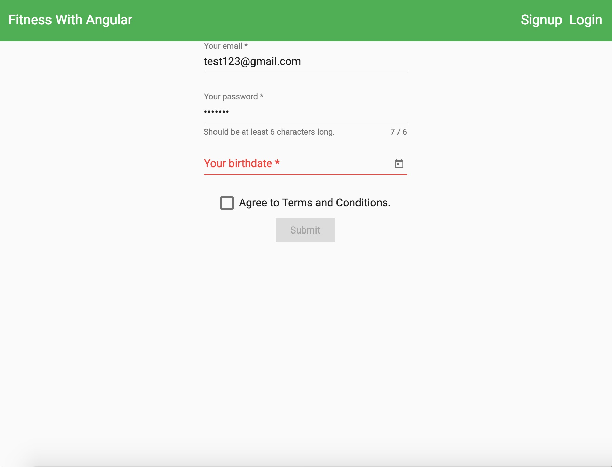
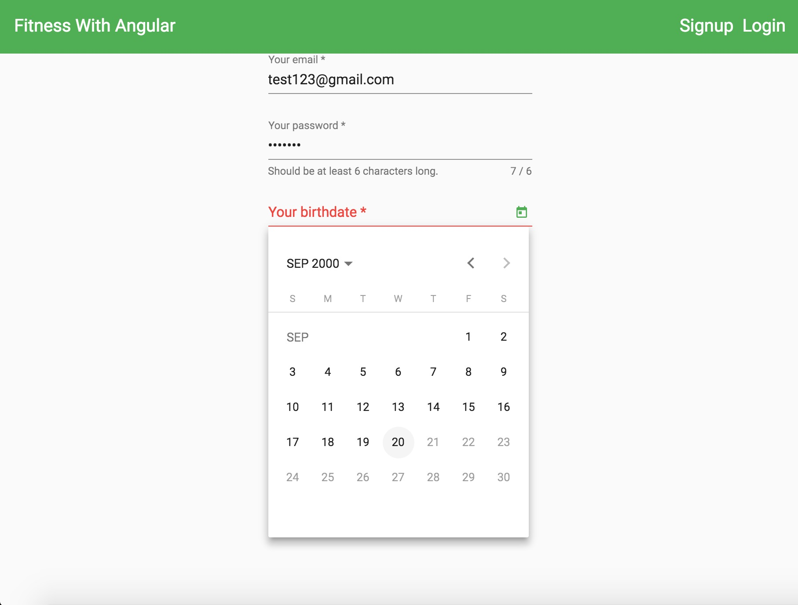
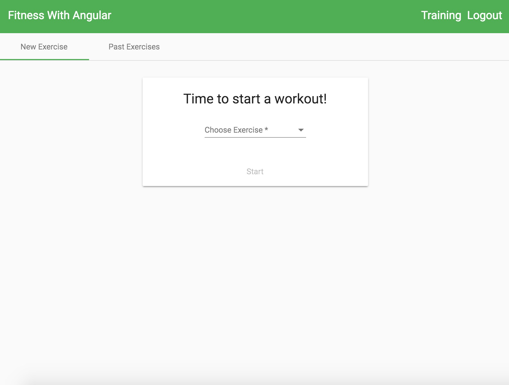
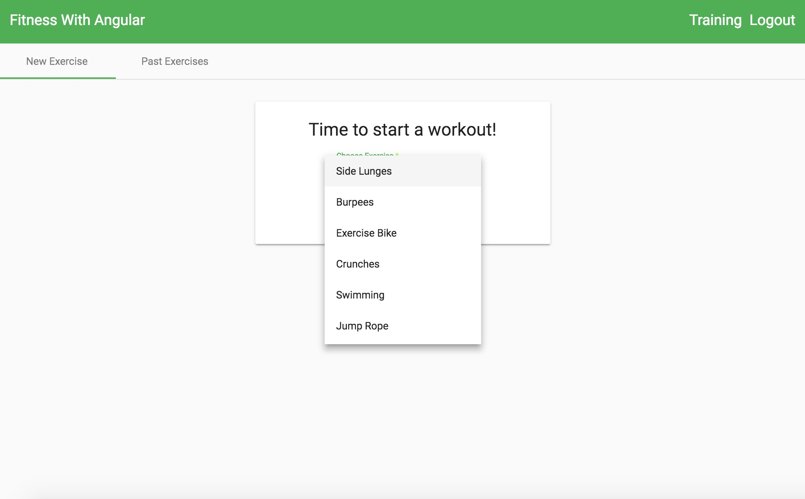
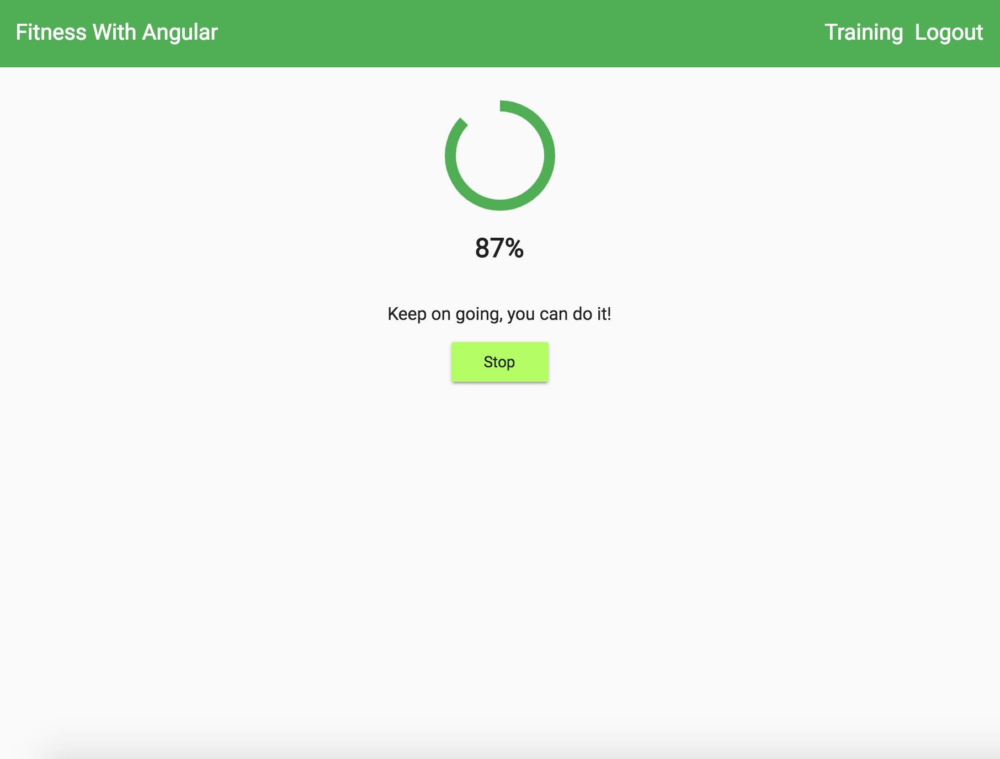

# Fitness-With-Angular
Fitness With Angular is a fitness tracker application that uses real-time database functionalities thanks to Firebase and AngularFire which allows users to see their updates almost instantly. NgRx is used as a Redux-inspired state management solution which enhances app state management.

The app first asks users to sign up or they won't be able to access the different exercises. You will be asked to enter your email, a password which is at least 6 characters long, and a birthdate which must be at least 18 yrs old. The sign-up form also has validation so you must enter valid information such as an email that is not already in use.

 

  

After successfully signing up, the user will land on the training page. They will be able to choose from a variety of exercises to workout to, or they may click the past exercises tab in order to see their previous workouts.

 

  

The user can also cancel or pause the exercise if they don't want to complete the whole duration. The calories will be adjusted according to how many seconds they performed the exercise.

  

Finally, after completing or cancelling the exercise, the previous exercise data will be viewable in a table format. The table uses pagination, has 5 different ways to sort, and also includes a filter at the top to quickly access specific exercises.

